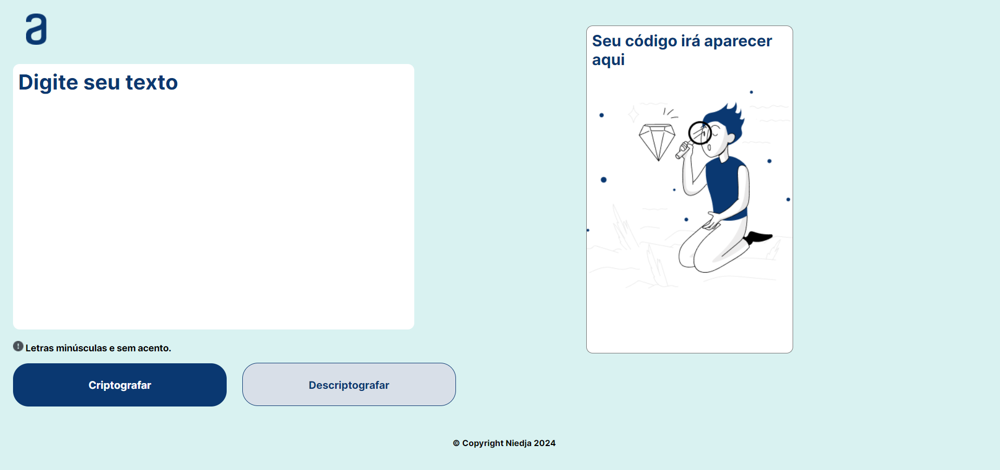

# Codificador-de-texto

Link do projeto: <https://github.com/Niedja92/Oracle-Next-Education---Fly-Education/tree/main/Challenge%20Decodificador%20de%20Texto>

## Sobre

Esse projeto como o nome diz é um codificador e decodifcador de texto, ao inserir o texto no local indicado e clicar em codificar,
vai aparecer o texto codificado na outra caixa que se encontra ao lado e também vai aparecr o botão de coipar o texto, depois você tem
a opção de decodificar.

## Tecnologias utilizadas

- HTML
- CSS
- JavaScript
